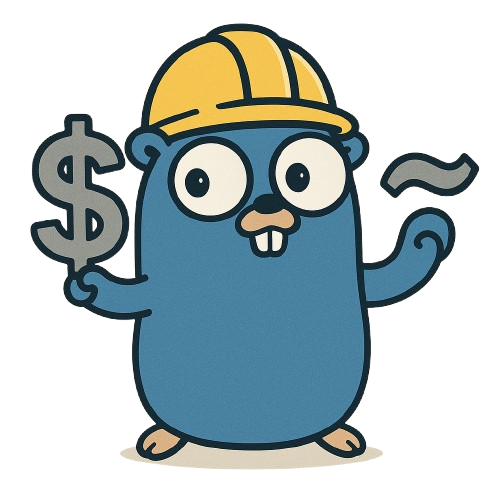

<p align="center">
  
</p>

<h1 align="center">Gocrafter</h1>

<p align="center">
  <b>Scaffold clean, production-ready Go projects with a single command.</b><br>
  Simple. Fast. Embedded templates. No fuss.
</p>

---

> Contributions welcome! See [CONTRIBUTING.md](CONTRIBUTING.md) for rules and guidelines.

## Overview

`Gocrafter` is a CLI tool for quickly generating idiomatic Go project structures and dowloading the required go packages. Whether you're building an API, CLI, or library, this tool creates boilerplate code and folder layout using embedded templates, no need to copy or clone anything.

Ideal for developers who want to start new Go projects quickly with best practices baked in.

---

## Installation

### Using `go install`

```bash
go install github.com/ErebusAJ/gocrafter@latest
````

> Make sure `$GOPATH/bin` is in your `$PATH`.

### Or clone & build-install manually

```bash
git clone https://github.com/ErebusAJ/gocrafter.git
cd gocrafter
go build -o gocrafter .
go install
```

---

## Usage

```bash
gocrafter init [flags]
```

Creates a new Go project in a new folder with the provided `--name` and `--module`.

You can also use a YAML config file to avoid long flag chains: 

Checkout a sample yaml file: [Config](config.yaml)

There are different types of template to choose from according to your project needs:
  - **api** (uses gin)
  - **cli** (uses cobra)
```bash
gocrafter init --config config.yaml
```

---

## Example with flags

```bash
gocrafter init \
  --name myapp \
  --module github.com/you/myapp \
  --template api \
  --database postgresql \
  --sqlc \
  --goose \
  --docker \
  --magefile
```

---

## Commands

| Command   | Description                   |
| --------- | ----------------------------- |
| `init`    | Initialize a new Go project   |
| `version` | Show version of `Gocrafter` |
| `help`    | Display help for any command  |

---

## Flags (init)

| Flag         | Description                                       |
| ------------ | ------------------------------------------------- |
| `--name`     | Name of the project (`myapp`)                     |
| `--module`   | Go module path (`github.com/you/myapp`)           |
| `--database` | Driver name of the database to setup (`postgresql`,`mysql`,`sqlite`) |
| `--sqlc`     | Include SQLC config                               |
| `--goose`    | Include Goose migration support                   |
| `--docker`   | Generate `Dockerfile`    |
| `--magefile`     | Generates magefile for CLI commands automation |
| `--template` | Project type (`api`, `cli`)                |
| `--config`   | Path to a YAML file with the same config          |

---

## License

This project is licensed under the GNU GPLv3 License see the [LICENSE](LICENSE) file for details.


---


## Author

Developed by [@ErebusAJ](https://github.com/ErebusAJ)
Feedback, stars, and contributions welcome!
